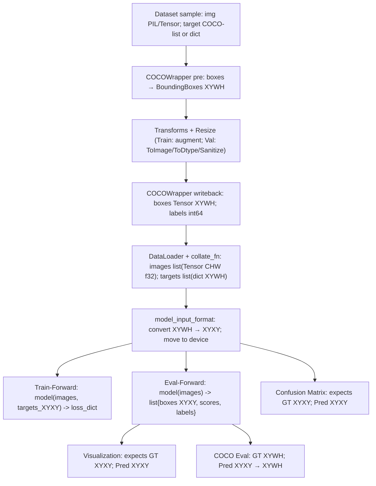
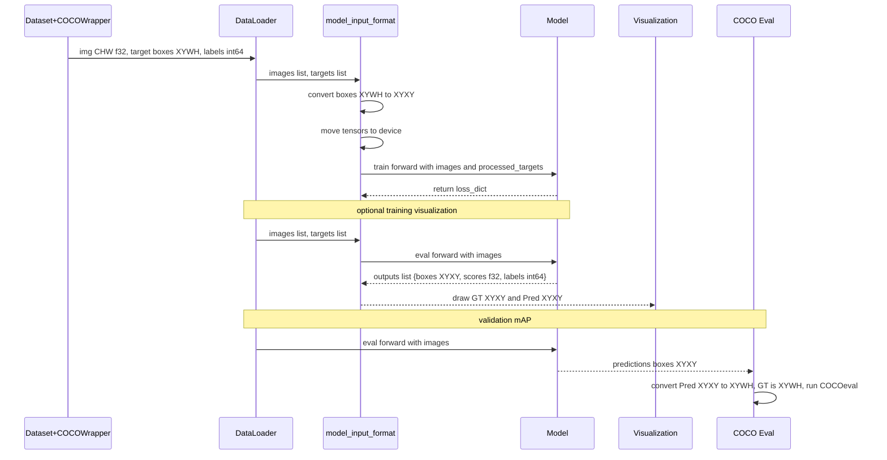

# Visualizations of dataformats and conversions
## BBox formats
- XYWH = [x_min, y_min, width, height] - (Pixel)
- XYXY = [x_min, y_min, x_max, y_max] - (Pixel)
- CHW = [Channels, Height, Width] - (float32)

## Dataset (Batch Sample)
- returns = img, targets

Sample (Dataset.__getitem__)
- returns: img, target

| Path            | DType         | Shape   | Notes               |
|-----------------|---------------|---------|---------------------|
| img             | torch.float32 | [C,H,W] | CHW Tensor          |
| target.boxes    | torch.float32 | [N,4]   | XYWH (pixels)       |
| target.labels   | torch.int64   | [N]     | class ids           |
| target.area     | torch.float32 | [N]     | w*h fallback        |
| target.iscrowd  | torch.int64   | [N]     | 0/1                 |
| target.image_id | torch.int64   | []      | scalar              |

Empty case (N=0): boxes [0,4], labels [0], area [0], iscrowd [0].

Batch (DataLoader + collate_fn)
- returns: images, targets

| Path                 | DType          | Shape                 | Notes                                 |
|----------------------|----------------|-----------------------|---------------------------------------|
| images               | list[Tensor]   | len=B, each [C,H,W]   | not stacked (variable boxes per image)|
| targets              | list[dict]     | len=B                 | one dict per image                    |
| targets[i].boxes     | torch.float32  | [Ni,4]                | XYWH (pixels)                         |
| targets[i].labels    | torch.int64    | [Ni]                  | class ids                             |
| targets[i].area      | torch.float32  | [Ni]                  | w*h fallback                          |
| targets[i].iscrowd   | torch.int64    | [Ni]                  | 0/1                                   |
| targets[i].image_id  | torch.int64    | []                    | scalar                                |

Model boundary (training loss)
- model_input_format(images, targets, "List", device):
  - images: list[Tensor] -> moved to device
  - targets: boxes XYWH -> XYXY (float32, device); labels int64 (device)

## Complete Flow: Formats across the Pipeline

## Training Epoch Sequence

