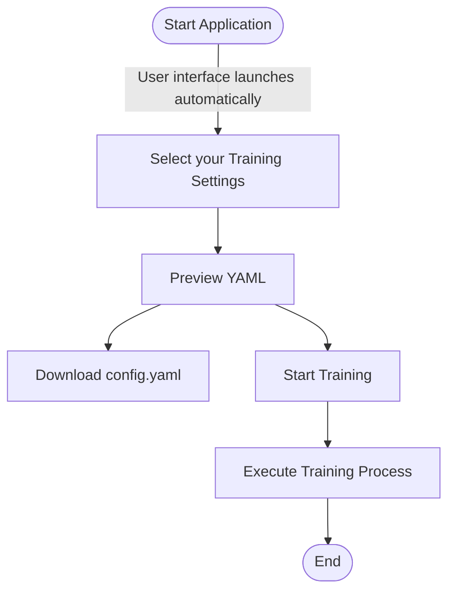
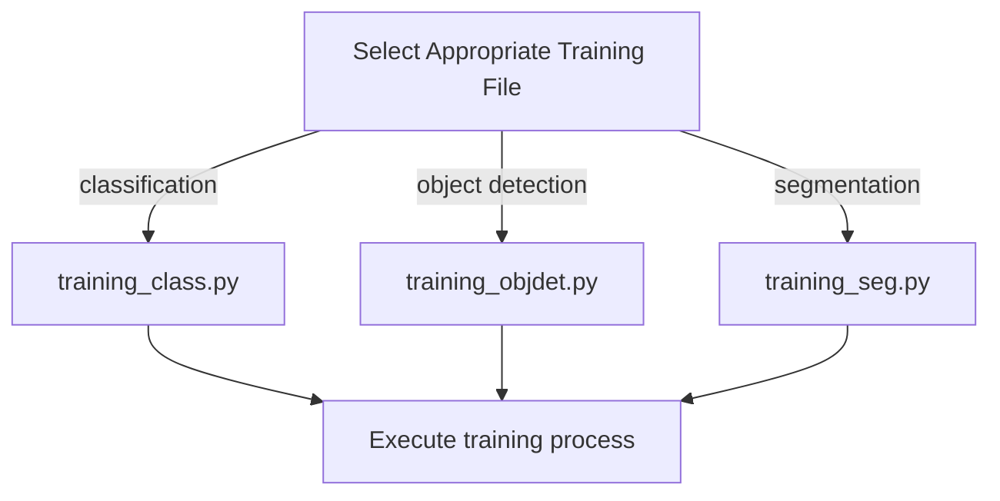

# AI Training Pipeline

## Quick Start
To use tha AI Pipeline you need to have the dependencies installed

- [Install dependencies](#installing-dependencies)
- [Start training](#start-training)

To make further changes in the Code go to:
- [Advanced Options](#advanced-options) (for your own datasets, augmentations and model architectures)
- [Dev Options](#dev-options) (for further changes)


## Installing Dependencies
All dependencies can be installed or looked up using the `package_installer.py` script located in the src folder:
```
# Navigate to the src folder
cd src/

# Run the installer script
python3 package_installer.py
```
This script will check and install all required dependencies for the AI Pipeline

You can install the necessary packages by launching the file. If you use conda just launch the file in the new env.

Otherwise if you like to use conda directly you can build the env by creating a new environment via the `environment.yml` file:
```
# Creating conda environment via the environment.yml file
conda env create -f environment.yml
```

If your on Linux it is recommended to aditionally install one of the following terminal emulators to have all functionality of the AI Pipeline
- xterm
- x-terminal-emulator
- gnome-terminal


## Start Training
To start the AI Pipeline you need to have the [dependencies](#installing-dependencies) installed.

The pipeline workflow starts with launching the `training.py` file in the src folder
```
# Navigate to the src folder
cd src/

# Run the installer script
python3 training.py
```
This will launch the browser application and allow you to configure the training settings.

Excerpt of the configuration application


### Start Training Workflow


At the moment only Linux with installed terminal emulators allows to start the training from the brower right away.
If your device meets that requirement you can start the training via the `Start Training` button.

If you have no terminal emulator installed or using Windows you have to start the training process manually after saving the `config.yaml` file in the `src/conf/` folder.

The manual start of the training is done by launching the file of the determied training task.




## View Results
After the training is completed you get an output like this:


You get a summary of where the data is stored and get the command to view the results in tensorboard
```
tensorboard --logdir=trained_models/{task}/{experiment_name}/tensorboard
```

___
## Advanced Options
To use tha AI Pipeline you need to have the dependencies installed

1. [Add Your Own Dataset](#add-your-own-dataset)
2. [Add Your Own Augmentation](#add-your-own-augmentation)
3. [Add Your Own Architecture](#add-your-own-architecture)


### Add Your Own Dataset
To add one of your own datasets you first need to know of which structure type your dataset is. With tools like roboflow you can export the dataset in any type you like, else you have to know the type of your dataset.

The datastructure is simple and structured by task and type of the data.
```
src/datasets/{task}/{type}/...
```
```
datasets/
├── classification/
│   ├── Type_Cifar10
    │   └── ...
│   ├── Type_ImgNet
    │   └── ...
│
├── object_detection/
│   ├── Type_COCO/
│   │   ├── DatasetName/
│   │   │   ├── README.dataset.txt
│   │   │   └── dataset/
│   │   │       ├── _annotations.coco.json
│   │   │       └── [image files]
│   │
│   └── Type_YOLO/
│       └── DatasetName/
│           ├── dataset/  # For auto-split
│           │   ├── images/
│           │   └── labels/
│           # OR
│           ├── train/  # If manually split
│           │   ├── images/
│           │   └── labels/
│           ├── valid/
│           │   ├── images/
│           │   └── labels/
│           └── test/
│               ├── images/
│               └── labels/
│
└── segmentation/
    ├── Type_Kitty/
    │   └── ...
```

### Add Your Own Augmentation
The current version of the pipeline **only supports augemntations written in `torchvision.transforms v2`** but support of `albumentations` is already planned

To generate your own Augmentation just copy the template file, add your augmentation and rename it individually in the augmentation folder

```
src/augmentations/{YourAugmentationFile}
```
#### Augmentation Template
```
import torch
from torchvision.transforms import v2


def augment():
    """
    Augmentation template
    """

    return v2.Compose(
        [
            v2.ToImage(),
            v2.ToDtype(torch.float32, scale=True),

            ########
            # Insert your own Augmentations here

            # Example:
            v2.RandomHorizontalFlip(p=0.5),
            v2.RandomAffine(
                degrees=15,
                translate=(0.1, 0.1),
                scale=(0.95, 1.05),
            ),
            ########

            v2.SanitizeBoundingBoxes(),
        ]
    )
```


### Implement Your Own Architectures
To start implementing your own models make yourself familiar with the architecture requirements

[Link zu den Anforderungen an die Architekturen]()


___
## Dev Options
If you would like to view the code or change something in the pipeline make yourself familiar with the [internal pipeline structure](#internal-pipeline-structure).

At the moment you can easily implement new or change existing parts like:

- Random Seed
- Pacience Counter For Early Stopping
- Scheduler
- Optimizer
- Freezing Strategies

For further changes please make sure not to break anything and test your work extensively.


### Internal Pipeline Structure

1. Setup Phase: Creates [experiment directories](#experiment-directories), configures [logging](#logging), and loads the specified [model architecture](#model-architecture).
2. Data Preparation: Sets up data transforms/[augmentation](#augmentation) and loads datasets with appropriate preprocessing.
3. Training Environment: Moves the model to the appropriate device (GPU/CPU), configures the [optimizer](#optimizer) and learning rate [scheduler](#scheduler).
4. Training Loop: For each epoch:
    - Processes batches of training data
    - Logs model parameters and visualizations
    - Validates on the validation set
    - Evaluates model performance using [COCO metrics](#coco-metrics)
    - Updates learning rate (if scheduler is used)
    - Saves checkpoints and tracks best model
5. [Early Stopping](#early-stopping): Monitors validation performance and stops training if no improvement is seen after a set number of epochs (changable but not in config).
6. [Evaluation](#evaluation): After training completes, the best model is evaluated on the test set to assess generalization performance.
7. [Results](#results): Creates comprehensive experiment summary including metrics, confusion matrices, and TensorBoard visualizations.


#### Pipeline Directories
##### Dataset Directories
##### Experiment Directories


#### Model Architecture
#### Augmentation
#### Optimizer
#### Scheduler
#### COCO Metrics
#### Early Stopping
#### Evaluation
#### Results
#### Logging


## Pipeline Construction

| Module | Description | Available standard options |
| --- | --- | --- |
| augmentations | Provides premade templates for augmentation. They are applied pre training, but do not create new datasets. | no_augments, augment_rotate_flip_shear_translate_brightness, augment_1 |
| conf | Contains the Config.yaml for training pipeline executions. | config.yaml |
| datasets | Contains Datasets | Cifar10, Pokemon, ImgNet, Yolo-Duckiebots-Lanes, Coco-Duckiebots-Lanes |
| model_architecture | Contains models.  | swin_transformer, cnn, ResNet50, vision_transformer |
| outputs | Temporary hydra files  |  |
| trained_models | Keeps the trained models and all according files. | Tensorboard, Model with weights, config file, summary, log file |
| training.py | Starts an app to configure the training. Sets the layout standards. |  |
| training_class.py | Executes the training | |


## Continuations

- Usage and Examples: Use this section to provide descriptions and usage examples for your project.

- Dependencies: List all external libraries or packages needed to run your project. This helps users understand what they should be familiar with.

- Documentation and Links: Provide links to additional documentation, the project website, or related resources.

- Changelog: Add a section listing the changes, updates, and improvements made in each version of your project.

- Known Issues: List any known issues or limitations with the current version of your project. This can provide an opportunity for contributions that address the issue.