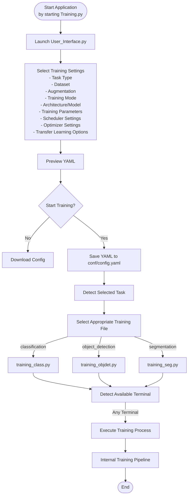

# AI_Training_Pipeline

## Contents
Insert table of contents!!!

## Quick Start

0. Run `package_installer.py`. It installs all necessary packages.
1. Run `training.py`. It starts a [browser app](http://localhost:8501) for training configuration.
2. Move the created config.yaml to folder: src>>conf
3. Depending on the task, run `training_[task].py`
4. Open [Tensorboard](http://127.0.0.1:16006/) for output.

## How to use

## Pipeline Construction

| Module | Description | Available standard options |
| --- | --- | --- |
| augmentations | Provides premade templates for augmentation. They are applied pre training, but do not create new datasets. | no_augments, augment_rotate_flip_shear_translate_brightness, augment_1 |
| conf | Contains the Config.yaml for training pipeline executions. | config.yaml |
| datasets | Contains Datasets | Cifar10, Pokemon, ImgNet, Yolo-Duckiebots-Lanes, Coco-Duckiebots-Lanes |
| model_architecture | Contains models.  | swin_transformer, cnn, ResNet50, vision_transformer |
| outputs | Temporary hydra files  |  |
| trained_models | Keeps the trained models and all according files. | Tensorboard, Model with weights, config file, summary, log file |
| training.py | Starts an app to configure the training. Sets the layout standards. |  |
| training_class.py | Executes the training | |

## training overview

| Module | Description | Available standard options |
| --- | --- | --- |
| 1. EXPERIMENT SETUP | Directorys and date-time setup | |
| 2. LOGGER SETUP | Creates and saves log for experiment in folders. | |
| 3. MODEL LOADING | Reads the selected model from the config.yaml, selects it from model_architecture folder and builds it. | |
| 4. AUGMENTATION | Adds the specified augmentation from augments folder. | no_augments, augment_rotate_flip_shear_translate_brightness, augment_1 |
| 5. DATASET TYPE LOADING | Selects the Type of the dataset. | Coco, Yolo |
| 6. MODEL TO DEVICE | Starts Cuda GPU if available. | GPU, CPU |
| 7. OPTIMIZER SETUP | Loads optimiser, learningrate and weight decay configuration. | Adam, AdamW, SGD, RMSprop, Adagrad, Adadelta |
| 8. SCHEDULER SETUP |  |  |
| 9. TENSORBOARD SETUP | Starts Tensorboard logging | training loss, validation loss, Precision, Recall, f1 |
| 10. TRAINING LOOP | Does the training and validation with metrics. Saves newest model |  |
| 11. TEST EVALUATION | Does the final Validation |  |
| 12. EXPERIMENT SUMMARY | creates a clean .yaml file from the training process. |  |
| 13. FINAL LOGGING | Summary of the training with the best scores and model. Displays options to procede from here. | result directory, TensorBoard, summary.yaml, training log, best model directory |

## Continuations

- Usage and Examples: Use this section to provide descriptions and usage examples for your project.

- Dependencies: List all external libraries or packages needed to run your project. This helps users understand what they should be familiar with.

- Documentation and Links: Provide links to additional documentation, the project website, or related resources.

- Changelog: Add a section listing the changes, updates, and improvements made in each version of your project.

- Known Issues: List any known issues or limitations with the current version of your project. This can provide an opportunity for contributions that address the issue.

## Start Training Workflow

___
## Internal Pipeline Structure

```mermaid
flowchart TD
    Start([Start]) --> ExperimentSetup[Setup Experiment Directory]
    ExperimentSetup --> LoggerSetup[Setup Logger]
    LoggerSetup --> ModelLoading[Load Model Architecture]
    ModelLoading --> DataAugmentation[Setup Data Transforms/Augmentation]
    DataAugmentation --> DatasetLoading[Load Datasets]
    DatasetLoading --> DataLoaderCreation[Create DataLoaders]
    DataLoaderCreation --> ModelToDevice[Model to Device]
    ModelToDevice --> OptimizerSetup[Setup Optimizer]
    OptimizerSetup --> SchedulerSetup[Setup LR Scheduler]
    SchedulerSetup --> TensorBoardSetup[Setup TensorBoard]
    
    TensorBoardSetup --> TrainingLoop[Start Training Loop]
    
    TrainingLoop --> |For each epoch| ClearGPUCache[Clear GPU Cache]
    ClearGPUCache --> TrainOneEpoch[Train One Epoch]
    TrainOneEpoch --> LogParameters[Log Model Parameters]
    LogParameters --> Visualizations[Log Visualizations]
    Visualizations --> ValidationPhase[Validate Model]
    ValidationPhase --> EvaluateMetrics[Evaluate COCO Metrics]
    
    EvaluateMetrics --> SchedulerStep{Use Scheduler?}
    SchedulerStep --> |Yes| PerformSchedulerStep[Perform Scheduler Step]
    SchedulerStep --> |No| LogEpochMetrics[Log Epoch Metrics]
    PerformSchedulerStep --> LogEpochMetrics
    
    LogEpochMetrics --> SaveCheckpoint[Save Checkpoint]
    SaveCheckpoint --> CheckBestModel{Is Best Model?}
    
    CheckBestModel --> |Yes| SaveBestModel[Save Best Model]
    CheckBestModel --> |No| IncrementPatience[Increment Patience Counter]
    SaveBestModel --> ResetPatience[Reset Patience Counter]
    
    ResetPatience --> CheckEpochEnd{More Epochs?}
    IncrementPatience --> CheckEarlyStop{Early Stopping?}
    
    CheckEarlyStop --> |Yes| TestEvaluation[Evaluation on Test Set]
    CheckEarlyStop --> |No| CheckEpochEnd
    
    CheckEpochEnd --> |Yes| TrainingLoop
    CheckEpochEnd --> |No| TestEvaluation
    
    TestEvaluation --> LoadBestModel[Load Best Model]
    LoadBestModel --> ComputeTestLoss[Compute Test Loss]
    ComputeTestLoss --> BuildConfusionMatrix[Build Confusion Matrix]
    BuildConfusionMatrix --> CreateSummary[Create Experiment Summary]
    CreateSummary --> CloseWriter[Close TensorBoard Writer]
    CloseWriter --> FinalLogging[Final Logging]
    FinalLogging --> End([End])
```

