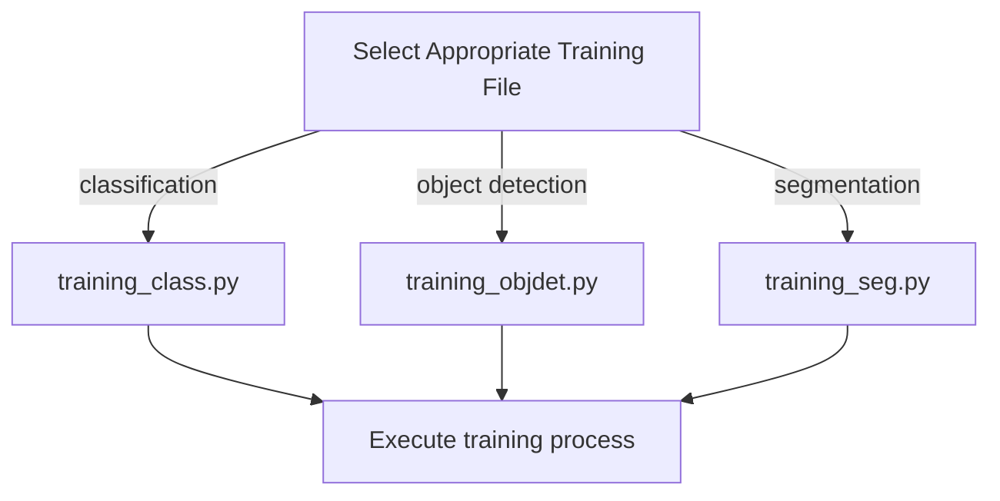
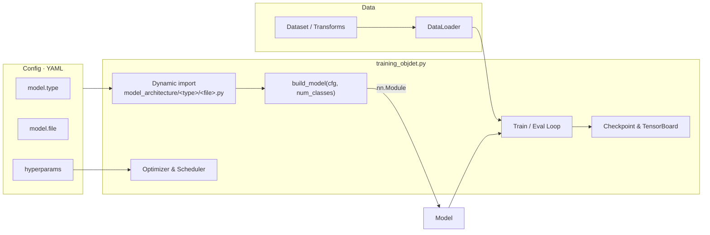
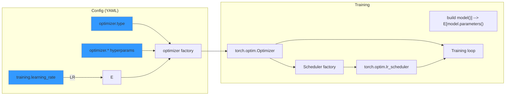
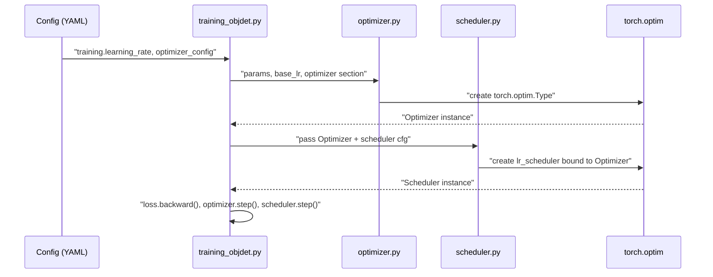

# AI Training Pipeline MFW

## Quick Start
To use the AI Pipeline you need to have the dependencies installed

- [Install dependencies](#installing-dependencies)
- [Start training](#start-training)
- [Compare models](#compare-models)

To make further changes in the Code go to:
- [Advanced Options](#advanced-options) (for your own datasets, augmentations and model architectures)
- [Dev Options](#dev-options) (for further changes)


## Installing Dependencies
All dependencies can be installed or looked up using the `package_installer.py` script located in the src folder:
```
# Navigate to the src folder
cd src/

# Run the installer script
python3 package_installer.py
```
This script will check and install all required dependencies for the AI Pipeline

You can install the necessary packages by launching the file. If you use conda just launch the file in the new env.

Otherwise if you like to use conda directly you can build the env by creating a new environment via the `environment.yml` file:
```
# Creating conda environment via the environment.yml file
conda env create -f environment.yml
```

If your on Linux it is recommended to aditionally install one of the following terminal emulators to have all functionality of the AI Pipeline
- xterm
- x-terminal-emulator
- gnome-terminal


## Start Training
To start the AI Pipeline you need to have the [dependencies](#installing-dependencies) installed.

The pipeline workflow starts with launching the `training.py` file in the src folder
```
# Navigate to the src folder
cd src/

# Run the installer script
python3 training.py
```
This will launch the browser application and allow you to configure the training settings.

Excerpt of the configuration application


### Start Training Workflow


At the moment only Linux with installed terminal emulators allows to start the training from the brower right away.
If your device meets that requirement you can start the training via the `Start Training` button.

If you have no terminal emulator installed or using Windows you have to start the training process manually after saving the `config.yaml` file in the `src/conf/` folder.

The manual start of the training is done by launching the file of the determied training task.




## View Results
After the training is completed you get an output like this:


You get a summary of where the data is stored and get the command to view the results in tensorboard
```
tensorboard --logdir=trained_models/{task}/{experiment_name}/tensorboard
```
## Compare Models
You can compare the tensorboard evaluation of multiple trained models via the model comparison.

The comparison starts with launching the `compare.py` file in the src folder
```
# Navigate to the src folder
cd src/

# Run the installer script
python3 compare.py
```
This will launch the browser application and allow you to select up to 10 previously trained models.

The application will generate the command to starte the tensorboards.
If you are on Linux and have a terminal emulator installed you can start the tensorboards with the button on the application.

If you are on Windows or have not the emulator installed you will have to manually copy paste the command in your terminal to start the comparison.

___
## Advanced Options
To use tha AI Pipeline you need to have the dependencies installed

1. [Add Your Own Dataset](#add-your-own-dataset)
2. [Add Your Own Augmentation](#add-your-own-augmentation)
3. [Add Your Own Architecture](#add-your-own-architecture)


### Add Your Own Dataset
To add one of your own datasets you first need to know of which structure type your dataset is. With tools like roboflow you can export the dataset in any type you like, else you have to know the type of your dataset.

The datastructure is simple and structured by task and type of the data.
```
src/datasets/{task}/{type}/...
```
```
datasets/
├── classification/
│   ├── Type_Cifar10
    │   └── ...
│   ├── Type_ImgNet
    │   └── ...
│
├── object_detection/
│   ├── Type_COCO/
│   │   ├── DatasetName/
│   │   │   ├── README.dataset.txt
│   │   │   ├── classes.yaml
│   │   │   └── dataset/
│   │   │       ├── _annotations.coco.json
│   │   │       └── [image files]
│   │
│   └── Type_YOLO/
│       └── DatasetName/
│           ├── dataset/  # For auto-split
│           │   ├── images/
│           │   └── labels/
│           ├── classes.yaml
│           # OR
│           ├── train/  # If manually split
│           │   ├── images/
│           │   └── labels/
│           ├── valid/
│           │   ├── images/
│           │   └── labels/
│           ├── test/
│           │    ├── images/
│           │    └── labels/
│           └──── classes.yaml
│
└── segmentation/
    ├── Type_Kitty/
    │   └── ...
```
**Note!** Dont forget the `classes.yaml` file with:
``` 
num_classes: [number of classes in the dataset]
``` 
For a more indebth look at how the dataset structure works it is recommended to consult the [Dataset Directories](#dataset-directories)


### Add Your Own Augmentation
The current version of the pipeline **only supports augemntations written in `torchvision.transforms v2`** but support of `albumentations` is already planned

To generate your own Augmentation just copy the template file, add your augmentation and rename it individually in the augmentation folder

```
src/augmentations/{YourAugmentationFile}
```
#### Augmentation Template
```
import torch
from torchvision.transforms import v2


def augment():
    """
    Augmentation template
    """

    return v2.Compose(
        [
            v2.ToImage(),
            v2.ToDtype(torch.float32, scale=True),
            ####################################
            # Insert your own Augmentations here
            # Example:
            v2.RandomHorizontalFlip(p=0.5),
            v2.RandomAffine(
                degrees=15,
                translate=(0.1, 0.1),
                scale=(0.95, 1.05),
            ),
            ####################################
            v2.SanitizeBoundingBoxes(),
        ]
    )
```


### Implement Your Own Architectures
The current version of the pipeline **only supports PyTorch model architectures and models compatible with that**, like Timm models.
Just like the datasets the model architectures follow the same folder structure of 
```
src/model_architecture/{task}/{YourModelName}
```
#### Folder Structure
```
model_architecture/
├── classification/
│   ├── resnet.py
│   ├── mobilenet.py
│   ├── efficientnet.py
│   ├── vit.py
│   └── custom_classifier.py
│
├── object_detection/
│   ├── faster_rcnn.py
│   ├── retinanet.py
│   ├── ssd.py
│   ├── yolo.py
│   └── custom_detector.py
│
└── segmentation/
    ├── unet.py
    ├── deeplabv3.py
    ├── fcn.py
    └── mask_rcnn.py
```

The architecture should follow standard PyTorch conventions. That means labeld Bounding-Boxes are expected to be in the XYXY-Convention opposed to other conventions like those of COCO, YOLO, etc. For the exact composition of the "targets" consult the [Trainings Data](#trainings-data) structure.
You can either:

1. **Use existing PyTorch models** - Import and configure models directly from `torchvision.models` or other libraries like `timm`
2. **Create custom architectures** - Implement your own model class by extending `torch.nn.Module` with the required forward pass implementation

Regardless of which approach you choose, you must implement the three required interface functions listed in the table below to ensure compatibility with the training pipeline

| Function | Purpose | Return Value |
|----------|---------|--------------|
| `build_model(num_classes)` | Creates and returns the model instance | Model object |
| `get_inputsize()` | Defines expected input dimensions | Tuple of (width, height) |
| `get_model_need()` | Specifies required input format | String: "Tensor" or "List" |

These functions must be defined at the module level (not inside classes) to be properly imported by the training pipeline.


For a more indebth look at how the architecture structure works it is recommended to consult the [Directories](#model-architecture)

___
## Dev Options
If you would like to view the code or change something in the pipeline make yourself familiar with the [internal pipeline structure](#internal-pipeline-structure).

At the moment you can easily implement new or change existing parts like:

- Random Seed
- Pacience Counter For Early Stopping
- Scheduler
- Optimizer
- Freezing Strategies

For further changes please make sure not to break anything and test your work extensively.
**Note** that the Pipeline internally works in COCO-Format, other formats like YOLO or Pascal (to be implemented) are transformed into the COCO-Format.
For the exact composition of the data consult the [Dataloader directory](#dataloader-directories). Later when giving the images and targets to the model, the targets are transformed in XYXY Pytorch convention. The Predicitons of the model are then transformed back into the COCO-Format.


### Internal Pipeline Structure

1. Setup Phase: Creates [experiment directories](#experiment-directories), configures [logging](#logging), and loads the specified [model architecture](#model-architecture).
2. Data Preparation: Sets up data transforms/[augmentation](#augmentation) and loads datasets with appropriate preprocessing.
3. Training Environment: Moves the model to the appropriate device (GPU/CPU), configures the [optimizer](#optimizer) and learning rate [scheduler](#scheduler).
4. Training Loop: For each epoch:
    - Processes batches of training data
    - Logs model parameters and visualizations
    - Validates on the validation set
    - Evaluates model performance using [COCO metrics](#coco-metrics)
    - Updates learning rate (if scheduler is used)
    - Saves checkpoints and tracks best model
5. [Early Stopping](#early-stopping): Monitors validation performance and stops training if no improvement is seen after a set number of epochs (changable but not in config).
6. [Evaluation](#evaluation): After training completes, the best model is evaluated on the test set to assess generalization performance.
7. [Results](#results): Creates comprehensive experiment summary including metrics, confusion matrices, and TensorBoard visualizations.


#### Pipeline Directories
The pipeline organizes all model architectures by task:

```
model_architecture/
├── classification/
│   ├── cnn_class_001.py
    └── ...
│
├── object_detection/
│   ├── cnn_001.py
    └── ...

│
└── segmentation/
    └── ...
```
To add a new model to the pipeline, save the file in the corresponding directory depending on the task it is designed for.

##### Dataset Directories
The datastructure is simple and structured by task and type of the data.
```
src/datasets/{task}/{type}/...
```
```
datasets/
├── classification/
│   ├── Type_Cifar10
    │   └── ...
│   ├── Type_ImgNet
    │   └── ...
│
├── object_detection/
│   ├── Type_COCO/
│   │   ├── DatasetName/
│   │   │   ├── README.dataset.txt
│   │   │   ├── classes.yaml
│   │   │   └── dataset/
│   │   │       ├── _annotations.coco.json
│   │   │       └── [image files]
│   │
│   └── Type_YOLO/
│       └── DatasetName/
│           ├── dataset/  # For auto-split
│           │   ├── images/
│           │   └── labels/
│           ├── classes.yaml
│           # OR
│           ├── train/  # If manually split
│           │   ├── images/
│           │   └── labels/
│           ├── valid/
│           │   ├── images/
│           │   └── labels/
│           ├── test/
│           │    ├── images/
│           │    └── labels/
│           └──── classes.yaml
│
└── segmentation/
    ├── Type_Kitty/
    │   └── ...
```

#### Dataloader Directories
The Dataloader is supplying iterated batches of `(images, targets)´ in classic COCO convention.

Images have the Type: List[torch.Tensor]; and the length of the batchsize.
Every entry is a picture as a tensor like:
form: (C, H, W)
datatype: torch.float32
value-range: [0,1]

Targets have the Type: List[Dict] and have the same length as the Images (batchsize).
Every entry is the coresponding annotations for the image:
    "boxes": Tensor[n, 4]      
    "labels": Tensor[n]       
    "image_id": Tensor[1]      
    "area": Tensor[n]        
    "iscrowd": Tensor[n]
With n being the number of objects in one image.

##### Experiment Directories
```
trained_models/
├── classification/
│   └── YYYYMMDD_experiment_name/
│       ├── models/
│       │   ├── best_model_info.pth
│       │   ├── best_model_weigts.pth
│       │   └── last_model.pth
│       ├── configs/
│       │   └── config.yaml
│       └── tensorboard/
│           └── events.out.tfevents.*
│
├── object_detection/
│   └── ...
│
└── segmentation/
    └── ...
```


#### Model Architecture
If you want to implement your own model or add another architecture to the pipeline, there are a few requirements to ensure compatibility.

Follow PyTorch’s nn.Module conventions when implementing your own architecture. (Also see [Training Data](#trainings-data))

What the Pipeline Handles Automatically
- Device placement .to(device) 
- FP32 inputs in range [0,1]  (do not normalize inside the model unless explicitly documented)
- Optimizer setup (optimizer.py + config)
- Scheduler setup (scheduler.py + config)
- Checkpoint saving and TensorBoard logging
- Data loading, resizing, and augmentation.


Common pitfalls:
- Wrong number of classes
    - For torchvision detection models, num_classes includes background. If you have K foreground classes, pass K+1.

- Transform/resize inside the model
    - Keep the model pure; the dataset/transform stack handles preprocessing.

- Forgetting eval/train modes
    - The trainer calls model.train() / model.eval(). Don’t override this flow inside your model.


How things Connect:


##### Template:
```
"""
Template Model for the Training Pipeline

How to use:
- Copy this file into model_architecture/<task>/ (classification, object_detection, segmentation)
- Rename the file to something descriptive (e.g., "fasterrcnn_mynet.py").
- Implement your own model inside build_model() or build_model_tr().
"""

import torch
import torch.nn as nn


# =========================================================
# Build fresh model (no transfer learning)
# =========================================================
def build_model(num_classes: int, pretrained: bool = False) -> nn.Module:
    """
    Build and return a new model instance.

    Args:
        num_classes (int): Number of output classes (for detection include background!)
        pretrained (bool): If True, load pretrained backbone (e.g. from torchvision or timm)

    Returns:
        torch.nn.Module: Model ready for training
    """
    # Example: simple CNN classifier (replace with your own model)
    model = nn.Sequential(
        nn.Conv2d(3, 16, kernel_size=3, stride=2, padding=1),
        nn.ReLU(),
        nn.Conv2d(16, 32, kernel_size=3, stride=2, padding=1),
        nn.ReLU(),
        nn.AdaptiveAvgPool2d((1, 1)),
        nn.Flatten(),
        nn.Linear(32, num_classes),
    )
    return model


# =========================================================
# Build model for transfer learning (optional)
# =========================================================
def build_model_tr(cfg) -> nn.Module:
    """
    Build model for transfer learning using cfg (with freezing strategies etc.).

    Args:
        cfg: Full Hydra config (cfg.model.transfer_learning contains details)

    Returns:
        torch.nn.Module: Model ready for fine-tuning
    """
    # Example: reuse build_model but adjust based on cfg
    num_classes = cfg.dataset.num_classes
    model = build_model(num_classes=num_classes, pretrained=True)

    if cfg.model.transfer_learning.freezing.enabled:
        strategy = cfg.model.transfer_learning.freezing.strategy
        if strategy == "freeze_all_except_head":
            for name, param in model.named_parameters():
                param.requires_grad = "head" in name
        elif strategy == "freeze_backbone":
            for name, param in model.named_parameters():
                if "backbone" in name:
                    param.requires_grad = False
        # add more strategies if needed

    return model


# =========================================================
# Input size helper
# =========================================================
def get_input_size() -> tuple[int, int]:
    """
    Define the input image size expected by the model.
    This helps the pipeline resize datasets correctly.

    Returns:
        (width, height): tuple of input dimensions
    """
    return 224, 224  # Change to match your model
    


# =========================================================
# Quick test (run this file directly)
# =========================================================
if __name__ == "__main__":
    model = build_model(num_classes=10, pretrained=False)
    print("Template model created successfully")

    dummy = torch.randn(1, 3, 224, 224)
    out = model(dummy)
    print(f"Dummy input shape: {dummy.shape}")
    print(f"Dummy output shape: {out.shape}")
```


#### Augmentation


#### Optimizer
In this part it will be explained how the Optimizer component is integrated into the KI_Pipeline, which optimizers are available, and how to add new ones. At a glance:
- Config-driven, no code changes needed for most tuning.
- Creates a PyTorch torch.optim.Optimizer from your model’s parameters and the pipeline config.


The pipeline currently supports the following optimizers:

| Optimizer  | Description | Typical Use Cases | Key Parameters |
|------------|-------------|-------------------|----------------|
| **Adam**   | Adaptive Moment Estimation – the most common choice for many tasks | General-purpose, fast convergence, robust on a wide range of problems | `lr`, `betas`, `eps`, `weight_decay`, `amsgrad` |
| **AdamW**  | Variant of Adam with **decoupled weight decay** – preferred for Transformers | NLP, Vision Transformers, transformer-like architectures | `lr`, `betas`, `eps`, `weight_decay`, `amsgrad` |
| **SGD**    | Stochastic Gradient Descent with Momentum – the classic optimizer | Traditional computer vision (CNNs), large datasets | `lr`, `momentum`, `weight_decay`, `dampening`, `nesterov` |
| **RMSprop** | Root Mean Square Propagation – stabilizes learning rates via moving averages | Recurrent neural networks (RNNs, LSTMs) | `lr`, `alpha`, `eps`, `weight_decay`, `momentum`, `centered` |
| **Adagrad** | Adaptive Gradient – adjusts LR per parameter, effective for **sparse gradients** | Text processing, recommendation systems, sparse data | `lr`, `lr_decay`, `eps`, `weight_decay`, `initial_accumulator_value` |
| **Adadelta** | Extension of Adagrad – no manual learning rate required | Tasks with highly dynamic gradients, avoids shrinking LR too quickly | `lr`, `rho`, `eps`, `weight_decay` |

The training script (e.g., training_objdet.py) loads the Hydra/YAML config, builds the model, and then asks the optimizer factory to create an optimizer for model.parameters(). The returned optimizer is later passed to the scheduler and the training loop.



Date flow with Scheduler


If you want to add a new optimizer, make sure that the config.yaml contains all needed params.

#### Scheduler

#### Trainings Data
Depending on `model_need´ in the model architecture the training data given to the model can take two forms.

For `model_need == "Tensor"`:
images: are stacked to a single tensor with the form: `(batch_size, C, H, W)`
processed_targets: a list of dicts with the length of `batch_size´ with "boxes" (XYXY) and "labels"

For `model_need == "List"`:
images: is a list of Tensors with every Tensor having the form: `(C, H, W)`
processed_targets: identical structure to model_need == "Tensor": a list of dicts with the length of `batch_size´ with "boxes" (XYXY) and "labels"

#### COCO Metrics

The following metrics are generated on the validation data using the COCO evaluation protocol (bbox IoU):

`AP` – Average Precision, averaged across IoU thresholds from 0.50 to 0.95 (main COCO metric).

`AP50 / AP75` – Precision at a fixed IoU of 0.50 (loose match) and 0.75 (stricter match).

`AP_small / AP_medium / AP_large` – Precision split by object size (COCO definitions).

`AR_k (e.g., AR_1, AR_10, AR_100)` – Average Recall, i.e. the fraction of ground-truth objects found when allowing up to k predictions per image.

`AR_small / AR_medium / AR_large` – Recall split by object size.

`Per-class AP/AR` – Detailed class-wise results to inspect individual categories.

Interpretation:

AP is the overall performance indicator (higher = better).

AP50 vs. AP75 shows whether detections are just roughly correct or well-localized.

AR shows how many objects the model finds, regardless of precision.

Per-class metrics help identify weaknesses for specific categories.


#### Early Stopping

During training, an early stopping mechanism monitors the validation loss to prevent overfitting:

After each epoch, the current validation loss is compared to the best loss so far.

If the loss improves, the best value is updated and the patience counter is reset.

If the loss does not improve, the patience counter increases.

Once the patience counter reaches the configured limit (`cfg.training.early_stopping_patience`), training stops early.

#### Evaluation


#### Results


#### Logging
The whole logging is done with loguru. For further information go to the [loguru documentation](https://loguru.readthedocs.io/en/stable/)


## Pipeline Construction

| Module | Description | Available standard options |
| --- | --- | --- |
| augmentations | Provides premade templates for augmentation. They are applied pre training, but do not create new datasets. | no_augments, augment_rotate_flip_shear_translate_brightness, augment_1 |
| conf | Contains the Config.yaml for training pipeline executions. | config.yaml |
| datasets | Contains Datasets | Cifar10, Pokemon, ImgNet, Yolo-Duckiebots-Lanes, Coco-Duckiebots-Lanes |
| model_architecture | Contains models.  | swin_transformer, cnn, ResNet50, vision_transformer |
| outputs | Temporary hydra files  |  |
| trained_models | Keeps the trained models and all according files. | Tensorboard, Model with weights, config file, summary, log file |
| training.py | Starts an app to configure the training. Sets the layout standards. |  |
| training_class.py | Executes the training | |


# KI Training Pipeline – Dateiübersicht

Diese Tabelle zeigt, welche Dateien welche Informationen **bereitstellen** und **benötigen**, sowie ihre Haupt-Outputs.

| Datei / Ressource | Stellt bereit (für andere) | Benötigt / Erwartet | Typische Aufrufer | Haupt-Outputs |
|-------------------|----------------------------|----------------------|-------------------|---------------|
| **User_Interface.py** | GUI (Streamlit) für Konfiguration und Start von Trainingsläufen; erzeugt `conf/config.yaml`. | Zugriff auf Dataset-Ordner (`datasets/...`), `classes.yaml` (für `num_classes`), verfügbare Modelle im Ordner `model_architecture/`. | Nutzer (GUI-Interaktion). Ruft anschließend `training_objdet.py` auf. | `conf/config.yaml` mit allen Parametern. |
| **config.py** | Definiert Hydra-Konfigurationsschema (`AIPipelineConfig`) inkl. Training, Scheduler, Optimizer, Augmentation, Model, Dataset. | Wird von Hydra geladen. Erwartet externe YAML-Configs. | `training_objdet.py`, `User_Interface.py`. | Konfigurationsobjekte für Training/Eval. |
| **training_objdet.py** | Orchestriert Training/Eval: lädt Config, Datasets, Modell; Training-Loop mit Logging, TensorBoard, Checkpoints. | `conf/config.yaml`, `config.py` Schema, Dataset-Ordner (`train/`, `val/`, `test/` mit Annotations), `classes.yaml`, Modellmodule (`fasterRCNN_001Resnet.py`, `fasterrcnn_swin_timm.py`). | Wird durch `User_Interface.py` oder CLI gestartet. | Checkpoints (`best_model_weights.pth`), Logs (`training.log`), TensorBoard-Runs, `experiment_summary.yaml`. |
| **fasterRCNN_001Resnet.py** | `build_model(num_classes)` für Faster R-CNN mit ResNet50-FPN Backbone. | torchvision (`fasterrcnn_resnet50_fpn`), `num_classes`. | `training_objdet.py`. | Initialisiertes Faster R-CNN-Modell. |
| **fasterrcnn_swin_timm.py** | `build_model(num_classes)` für Faster R-CNN mit Swin-Backbone (über `timm`) + FPN. | `timm`, torchvision detection API, `num_classes`. | `training_objdet.py`. | Initialisiertes Faster R-CNN (Swin-Backbone). |
| **Dataset-Ordner** (`train/`, `val/`, `test/`) | Bilder + Labels (COCO, YOLO, Pascal V1.0). | Korrektes Format (z. B. `train/_annotations.coco.json`). | `training_objdet.py` via Dataloader. | Eingabedaten für Training/Eval. |
| **classes.yaml** | Enthält `num_classes` (und ggf. Klassenliste). | Muss konsistent mit Annotationen sein. | `User_Interface.py` (liest Anzahl Klassen), `training_objdet.py`. | Zahl der Klassen → für Model-Head. |


## Continuations

- Usage and Examples: Use this section to provide descriptions and usage examples for your project.

- Dependencies: List all external libraries or packages needed to run your project. This helps users understand what they should be familiar with.

- Documentation and Links: Provide links to additional documentation, the project website, or related resources.

- Changelog: Add a section listing the changes, updates, and improvements made in each version of your project.

- Known Issues: List any known issues or limitations with the current version of your project. This can provide an opportunity for contributions that address the issue.