# AI Training Pipeline MFW

## Quick Start Guide

To use the AI Pipeline you need to have the dependencies installed

- [Install dependencies](#installing-dependencies)
- [Start training](#start-training)
- [Compare models](#compare-models)

To make further changes in the Code go to:

- [Advanced Options](#advanced-options) (for your own datasets, augmentations and model architectures)
- [Dev Options](#dev-options) (for further changes)

## Installing Dependencies

All dependencies can be installed or looked up using the `package_installer.py` script located in the src folder:

```
# Navigate to the src folder
cd src/

# Run the installer script
python3 package_installer.py
```

This script will check and install all required dependencies for the AI Pipeline

You can install the necessary packages by launching the file. If you use conda just launch the file in the new env.

Otherwise if you like to use conda directly you can build the env by creating a new environment via the `environment.yml` file:

```
# Creating conda environment via the environment.yml file
conda env create -f environment.yml
```

If your on Linux it is recommended to aditionally install one of the following terminal emulators to have all functionality of the AI Pipeline

- xterm
- x-terminal-emulator
- gnome-terminal

## Docker

Build image:

```
docker build -t ki-pipeline:cuda 
```
Docker Compose Build:
```
docker compose build
```
Start training:
```
docker compose up ki_pipeline_train
```
Start evaluation:
```
docker compose up ki_pipeline_eval
```
Stop:
```
docker compose down
```

## Start Training

To start the AI Pipeline you need to have the [dependencies](#installing-dependencies) installed.

The pipeline workflow starts with launching the `training.py` file in the src folder

```
# Navigate to the src folder
cd src/

# Run the installer script
python3 training.py
```
This will launch the browser application and allow you to configure the training settings.

Excerpt of the configuration application


### Start Training Workflow


At the moment only Linux with installed terminal emulators allows to start the training from the brower right away.
If your device meets that requirement you can start the training via the `Start Training` button.

If you have no terminal emulator installed or using Windows you have to start the training process manually after saving the `config.yaml` file in the `src/conf/` folder.

The manual start of the training is done by launching the file of the determied training task.


## View Results

After the training is completed you get an output like this:


You get a summary of where the data is stored and get the command to view the results in tensorboard.

```
tensorboard --logdir=trained_models/{task}/{experiment_name}/tensorboard
```

## Compare Models

You can compare the tensorboard evaluation of multiple trained models via the model comparison.

The comparison starts with launching the `compare.py` file in the src folder

```
# Navigate to the src folder
cd src/

# Run the installer script
python3 compare.py
```

This will launch the browser application and allow you to select up to 10 previously trained models.

The application will generate the command to starte the tensorboards.
If you are on Linux and have a terminal emulator installed you can start the tensorboards with the button on the application.

If you are on Windows or have not the emulator installed you will have to manually copy paste the command in your terminal to start the comparison.

___

## Advanced Options

To use tha AI Pipeline you need to have the dependencies installed

1. [Add Your Own Dataset](#add-your-own-dataset)
2. [Add Your Own Augmentation](#add-your-own-augmentation)
3. [Add Your Own Architecture](#add-your-own-architecture)

### Add Your Own Dataset

To add one of your own datasets you first need to know of which structure type your dataset is. With tools like roboflow you can export the dataset in any type you like, else you have to know the type of your dataset.

The datastructure is simple and structured by task and type of the data.

```
src/datasets/{task}/{type}/...
```

```
datasets/
├── classification/
│   ├── Type_Cifar10
    │   └── ...
│   ├── Type_ImgNet
    │   └── ...
│
├── object_detection/
│   ├── Type_COCO/
│   │   ├── DatasetName/
│   │   │   ├── README.dataset.txt
│   │   │   ├── classes.yaml
│   │   │   └── dataset/
│   │   │       ├── _annotations.coco.json
│   │   │       └── [image files]
│   │
│   └── Type_YOLO/
│       └── DatasetName/
│           ├── dataset/  # For auto-split
│           │   ├── images/
│           │   └── labels/
│           ├── classes.yaml
│           # OR
│           ├── train/  # If manually split
│           │   ├── images/
│           │   └── labels/
│           ├── valid/
│           │   ├── images/
│           │   └── labels/
│           ├── test/
│           │    ├── images/
│           │    └── labels/
│           └──── classes.yaml
│
└── segmentation/
    ├── Type_Kitty/
    │   └── ...
```

**Note!** Dont forget the `classes.yaml` file with:

``` 
num_classes: [number of classes in the dataset]
```

For a more indebth look at how the dataset structure works it is recommended to consult the [Dataset Directories](#dataset-directories)

### Add Your Own Augmentation

The current version of the pipeline **only supports augemntations written in `torchvision.transforms v2`** but support of `albumentations` is already planned

To generate your own Augmentation just copy the template file, add your augmentation and rename it individually in the augmentation folder

```
src/augmentations/{YourAugmentationFile}
```

#### Augmentation Template

```
import torch
from torchvision.transforms import v2


def augment():
    """
    Augmentation template
    """

    return v2.Compose(
        [
            v2.ToImage(),
            v2.ToDtype(torch.float32, scale=True),
            ####################################
            # Insert your own Augmentations here
            # Example:
            v2.RandomHorizontalFlip(p=0.5),
            v2.RandomAffine(
                degrees=15,
                translate=(0.1, 0.1),
                scale=(0.95, 1.05),
            ),
            ####################################
            v2.SanitizeBoundingBoxes(),
        ]
    )
```

### Add Your Own Architecture

The current version of the pipeline **only supports PyTorch model architectures and models compatible with that**, like Timm models.
Just like the datasets the model architectures follow the same folder structure of

```
src/model_architecture/{task}/{YourModelName}
```

#### Folder Structure

```
model_architecture/
├── classification/
│   ├── resnet.py
│   ├── mobilenet.py
│   ├── efficientnet.py
│   ├── vit.py
│   └── custom_classifier.py
│
├── object_detection/
│   ├── faster_rcnn.py
│   ├── retinanet.py
│   ├── ssd.py
│   ├── yolo.py
│   └── custom_detector.py
│
└── segmentation/
    ├── unet.py
    ├── deeplabv3.py
    ├── fcn.py
    └── mask_rcnn.py
```

The architecture should follow standard PyTorch conventions. That means labeld Bounding-Boxes are expected to be in the XYXY-Convention opposed to other conventions like those of COCO, YOLO, etc. For the exact composition of the "targets" consult the [Training Data](#training-data) structure.
You can either:

1. **Use existing PyTorch models** - Import and configure models directly from `torchvision.models` or other libraries like `timm`
2. **Create custom architectures** - Implement your own model class by extending `torch.nn.Module` with the required forward pass implementation

Regardless of which approach you choose, you must implement the three required interface functions listed in the table below to ensure compatibility with the training pipeline

| Function | Purpose | Return Value |
|----------|---------|--------------|
| `build_model(num_classes)` | Creates and returns the model instance | Model object |
| `get_inputsize()` | Defines expected input dimensions | Tuple of (width, height) |
| `get_model_need()` | Specifies required input format | String: "Tensor" or "List" |

These functions must be defined at the module level (not inside classes) to be properly imported by the training pipeline.

For a more indebth look at how the architecture structure works it is recommended to consult the [Directories](#model-architecture)

___

## Dev Options

If you would like to view the code or change something in the pipeline make yourself familiar with the [internal pipeline structure](#internal-pipeline-structure).
A Dictionary for every function in the code can be found in the [function dictionary](#function-dictionary)

At the moment you can easily implement new or change existing parts like:

- Random Seed
- Pacience Counter For Early Stopping
- Scheduler
- Optimizer
- Freezing Strategies

**Note** that the Pipeline internally works in COCO-Format, other formats like YOLO or Pascal are transformed into the COCO-Format.
For the exact composition of the data consult the [Dataloader directory](#dataloader-directories). Later when giving the images and targets to the model, the targets are transformed in XYXY Pytorch convention. The Predicitons of the model are then transformed back into the COCO-Format.

### Internal Pipeline Structure

1. Setup Phase: Creates [experiment directories](#experiment-directories), configures [logging](#logging), and loads the specified [model architecture](#model-architecture).
2. Data Preparation: Sets up data transforms/[augmentation](#augmentation template) and loads datasets with appropriate preprocessing.
3. Training Environment: Moves the model to the appropriate device (GPU/CPU), configures the [optimizer](#optimizer) and learning rate [scheduler](#scheduler).
4. Training Loop: For each epoch:
    - Processes batches of training data
    - Logs model parameters and visualizations
    - Validates on the validation set
    - Evaluates model performance using [COCO metrics](#coco-metrics)
    - Updates learning rate (if scheduler is used)
    - Saves checkpoints and tracks best model
5. [Early Stopping](#early-stopping): Monitors validation performance and stops training if no improvement is seen after a set number of epochs (changable but not in config).
6. [Evaluation](#evaluation): After training completes, the best model is evaluated on the test set to assess generalization performance.
7. [Results](#results): Creates comprehensive experiment summary including metrics, confusion matrices, and TensorBoard visualizations.


#### Pipeline Directories

The pipeline organizes all model architectures by task:

```
model_architecture/
├── classification/
│   ├── cnn_class_001.py
    └── ...
│
├── object_detection/
│   ├── cnn_001.py
    └── ...

│
└── segmentation/
    └── ...
```

To add a new model to the pipeline, save the file in the corresponding directory depending on the task it is designed for.

##### Dataset Directories

The datastructure is simple and structured by task and type of the data.

```
src/datasets/{task}/{type}/...
```

```
datasets/
├── classification/
│   ├── Type_Cifar10
    │   └── ...
│   ├── Type_ImgNet
    │   └── ...
│
├── object_detection/
│   ├── Type_COCO/
│   │   ├── DatasetName/
│   │   │   ├── README.dataset.txt
│   │   │   ├── classes.yaml
│   │   │   └── dataset/
│   │   │       ├── _annotations.coco.json
│   │   │       └── [image files]
│   │
│   └── Type_YOLO/
│       └── DatasetName/
│           ├── dataset/  # For auto-split
│           │   ├── images/
│           │   └── labels/
│           ├── classes.yaml
│           # OR
│           ├── train/  # If manually split
│           │   ├── images/
│           │   └── labels/
│           ├── valid/
│           │   ├── images/
│           │   └── labels/
│           ├── test/
│           │    ├── images/
│           │    └── labels/
│           └──── classes.yaml
│
└── segmentation/
    ├── Type_Kitty/
    │   └── ...
```

Our training pipeline supports three common dataset formats: COCO, Pascal_V10, and YOLO. Each format has a specific structure for storing images and annotations, and the training script automatically loads them based on the selected ```dataset.type```

**COCO Dataset Format**

- Structure 
```
dataset_root/
├── train/
│   ├── images...
│   └── _annotations.coco.json
├── valid/
│   ├── images...
│   └── _annotations.coco.json
└── test/
    ├── images...
    └── _annotations.coco.json
```
- Annotation file: JSON in COCO format, containing:

    - images: metadata for each image (id, file_name, width, height).

    - annotations: bounding boxes in ```[x, y, width, height]``` (top-left + width/height) format.

    - categories: mapping of class IDs to names (contiguous integers starting from 1).

**Pascal_V10 Dataset Format**

- Structure 
```
dataset_root/
├── train/
│   ├── images/
│   └── labels/
├── valid/
│   ├── images/
│   └── labels/
└── test/
    ├── images/
    └── labels/
```
- Annotations: Usually in Pascal VOC XML format (per image).

    - Each XML contains:

        - ```<object>``` elements with name (class label).

        - Bounding box: ```<bndbox>``` with ```[x, y, x, y]``` (xmin, ymin, xmax, ymax).
    - Ensure XML filenames match image filenames.

**YOLO Dataset Format**

- Structure 
```
dataset_root/
├── train/
│   ├── images/
│   └── labels/
├── valid/
│   ├── images/
│   └── labels/
└── test/
    ├── images/
    └── labels/
```
- Annotations: One ```.txt``` file per image, same name as the image.

    - Each line:

        - ``` class_id, x , y, width, height ``` (x_center, y_center, width, height)

**Comparison Table**:
| Feature              | **COCO**                                                                 | **Pascal_V10**                                      | **YOLO**                                      |
|----------------------|-------------------------------------------------------------------------|----------------------------------------------------|-----------------------------------------------|
| **Folder structure** | `train/`, `valid/`, `test/` each with images and a single JSON file      | `train/`, `valid/`, `test/` each with `images/` + `labels/` (XML) | `train/`, `valid/`, `test/` each with `images/` + `labels/` (TXT) |
| **Annotation file**  | `_annotations.coco.json` per split                                       | One **XML file** per image                          | One **TXT file** per image                     |
| **Box format**       | `XYWH` (x, y, width, height)                                            | `XYXY` (xmin, ymin, xmax, ymax)                     | Normalized `XYWH` (center_x, center_y, width, height) in [0..1] |
| **Classes**          | Defined in `categories` list inside JSON (IDs contiguous from 1)         | In XML `<object><name>`                             | First value in each TXT line (`class_id`)      |
| **Example**          | `"bbox": [100, 200, 50, 80], "category_id": 3`                         | `<bndbox><xmin>100</xmin><ymin>200</ymin> ... </bndbox>` | `3 0.45 0.52 0.20 0.15`                        |

#### Dataloader Directories

The Dataloader is supplying iterated batches of `(images, targets)´ in classic COCO convention.

Images have the Type: List[torch.Tensor]; and the length of the batchsize.
Every entry is a picture as a tensor like:
form: (C, H, W)
datatype: torch.float32
value-range: [0,1]

Targets have the Type: List[Dict] and have the same length as the Images (batchsize).
Every entry is the coresponding annotations for the image:

    "boxes": Tensor[n, 4]  
    "labels": Tensor[n]  
    "image_id": Tensor[1]  
    "area": Tensor[n]  
    "iscrowd": Tensor[n]  

With n being the number of objects in one image.

##### Experiment Directories

```
trained_models/
├── classification/
│   └── YYYYMMDD_experiment_name/
│       ├── models/
│       │   ├── best_model_info.pth
│       │   ├── best_model_weigts.pth
│       │   └── last_model.pth
│       ├── configs/
│       │   └── config.yaml
│       └── tensorboard/
│           └── events.out.tfevents.*
│
├── object_detection/
│   └── ...
│
└── segmentation/
    └── ...
```

#### Model Architecture

If you want to implement your own model or add another architecture to the pipeline, there are a few requirements to ensure compatibility.

Follow PyTorch’s nn.Module conventions when implementing your own architecture. (Also see [Training Data](#training-data))

What the Pipeline Handles Automatically

- Device placement .to(device)
- FP32 inputs in range [0,1]  (do not normalize inside the model unless explicitly documented)
- Optimizer setup (optimizer.py + config)
- Scheduler setup (scheduler.py + config)
- Checkpoint saving and TensorBoard logging
- Data loading, resizing, and augmentation.

Common pitfalls:

- Wrong number of classes
    - For torchvision detection models, num_classes includes background. If you have K foreground classes, pass K+1.

- Transform/resize inside the model
    - Keep the model pure; the dataset/transform stack handles preprocessing.

- Forgetting eval/train modes
    - The trainer calls model.train() / model.eval(). Don’t override this flow inside your model.

How things Connect:

```mermaid
flowchart LR
  %% --- CONFIG ---
  subgraph CFG["Config · YAML"]
    A["model.type"]
    B["model.file"]
    C["hyperparams"]
  end

  %% --- DATA ---
  subgraph DATA["Data"]
    D["Dataset / Transforms"]
    E["DataLoader"]
  end

  %% --- TRAINER ---
  subgraph TRAINER["training_objdet.py"]
    F["Dynamic import<br/>model_architecture/&lt;type&gt;/&lt;file&gt;.py"]
    G["build_model(cfg, num_classes)"]
    H["Optimizer &amp; Scheduler"]
    I["Train / Eval Loop"]
    J["Checkpoint &amp; TensorBoard"]
  end

  CFG --> F --> G -->|nn.Module| K["Model"]
  D --> E --> I
  C --> H
  K --> I --> J
```



#### Template
```
"""
Template Model Architecture for the Training Pipeline

You can use this template by copying it and personalize the used object detection model or you can create your own model architecture in a seperate class and call it in the get_model function.

How to use:
- Copy this file into model_architecture/<task>/ (classification, object_detection, segmentation)
- Rename the file to something descriptive
- Implement your own model inside get_model()
"""

import torch
from torchvision.models.detection import (
    FasterRCNN_ResNet50_FPN_Weights,
    fasterrcnn_resnet50_fpn,
)

#######################################################
#  IMPLEMENT YOUR OWN MODEL CLASS HERE
#######################################################


#######################################################
# CALL THE MODEL IN THE PREFFERED CONFIGURATION HERE
#######################################################

def get_model(num_classes: int, pretrained: bool = True):
    if pretrained:
        weights = FasterRCNN_ResNet50_FPN_Weights.DEFAULT
        model = fasterrcnn_resnet50_fpn(weights=weights, min_size=224, max_size=512)
    else:
        model = fasterrcnn_resnet50_fpn(weights=None, weights_backbone=None, min_size=224, max_size=512)

    in_features = model.roi_heads.box_predictor.cls_score.in_features
    from torchvision.models.detection.faster_rcnn import FastRCNNPredictor

    model.roi_heads.box_predictor = FastRCNNPredictor(in_features, num_classes)
    return model


#######################################################
# FUNCTIONS EXPECTED BY THE PIPELINE
#######################################################

def build_model(num_classes: int):
    # "Fresh model" without Pretrained
    return get_model(num_classes=num_classes, pretrained=False)


def get_input_size():
    # Input Size für Faster R-CNN ist variabel, aber typischerweise 800x800
    return 224, 224 # here set to 224, 224 to improve training time and storage


def get_model_need():
    return "Tensor" # either "Tensor" or "List"


#######################################################
# OPTIONAL: FUNCTIONALITY TEST OF MODEL
#######################################################
if __name__ == "__main__":
    model = build_model(num_classes=20)
    model.eval()
    dummy_input = torch.randn(1, 3, 416, 416)
    output = model(dummy_input)
    print("fasterRCNN_001Resnet Model loaded successfully!")
    print(f"Input size: {get_input_size()}")
    print(f"Dummy output: {output}")

```


#### Optimizer

In this part it will be explained how the Optimizer component is integrated into the KI_Pipeline, which optimizers are available, and how to add new ones. At a glance:

- Config-driven, no code changes needed for most tuning.
- Creates a PyTorch torch.optim.Optimizer from your model’s parameters and the pipeline config.

The pipeline currently supports the following optimizers:

| Optimizer  | Description | Typical Use Cases | Key Parameters |
|------------|-------------|-------------------|----------------|
| **Adam**   | Adaptive Moment Estimation – the most common choice for many tasks | General-purpose, fast convergence, robust on a wide range of problems | `lr`, `betas`, `eps`, `weight_decay`, `amsgrad` |
| **AdamW**  | Variant of Adam with **decoupled weight decay** – preferred for Transformers | NLP, Vision Transformers, transformer-like architectures | `lr`, `betas`, `eps`, `weight_decay`, `amsgrad` |
| **SGD**    | Stochastic Gradient Descent with Momentum – the classic optimizer | Traditional computer vision (CNNs), large datasets | `lr`, `momentum`, `weight_decay`, `dampening`, `nesterov` |
| **RMSprop** | Root Mean Square Propagation – stabilizes learning rates via moving averages | Recurrent neural networks (RNNs, LSTMs) | `lr`, `alpha`, `eps`, `weight_decay`, `momentum`, `centered` |
| **Adagrad** | Adaptive Gradient – adjusts LR per parameter, effective for **sparse gradients** | Text processing, recommendation systems, sparse data | `lr`, `lr_decay`, `eps`, `weight_decay`, `initial_accumulator_value` |
| **Adadelta** | Extension of Adagrad – no manual learning rate required | Tasks with highly dynamic gradients, avoids shrinking LR too quickly | `lr`, `rho`, `eps`, `weight_decay` |

The training script (e.g., training_objdet.py) loads the Hydra/YAML config, builds the model, and then asks the optimizer factory to create an optimizer for model.parameters(). The returned optimizer is later passed to the scheduler and the training loop.


Date flow with Scheduler


If you want to add a new optimizer, make sure that the config.yaml contains all needed params.

#### Scheduler

The Scheduler is a critical component in the training pipeline that dynamically adjusts the learning rate during training. The learning rate is one of the most important hyperparameters in deep learning, as it controls how much the model weights are updated during each optimization step. The scheduler ensures that the learning rate adapts to the training progress, which can help the model converge faster and avoid overfitting.

How it works: The scheduler interacts with the optimizer. After each epoch or based on specific metrics (like validation loss), the scheduler adjusts the learning rate according to its predefined strategy.

Supported Schedulers:

- StepLR: Reduces the learning rate by a factor (gamma) every step_size epochs.

- MultiStepLR: Reduces the learning rate at specific milestone epochs.

- ExponentialLR: Applies exponential decay to the learning rate.

- CosineAnnealingLR: Gradually reduces the learning rate following a cosine curve.

- ReduceLROnPlateau: Reduces the learning rate when a monitored metric (e.g., validation loss) stops improving.

- Configuration: The scheduler is configured in the `config.yaml` file. Parameters like type, patience, factor, and min_lr can be customized.

- Integration: During training, the scheduler is invoked after each epoch or when a specific condition is met. It works seamlessly with the optimizer to ensure efficient training.

#### Training Data

Depending on `model_need´ in the model architecture the training data given to the model can take two forms.

For `model_need == "Tensor"`:
images: are stacked to a single tensor with the form: `(batch_size, C, H, W)`
processed_targets: a list of dicts with the length of `batch_size´ with "boxes" (XYXY) and "labels"

For `model_need == "List"`:
images: is a list of Tensors with every Tensor having the form: `(C, H, W)`
processed_targets: identical structure to model_need == "Tensor": a list of dicts with the length of `batch_size´ with "boxes" (XYXY) and "labels"

#### COCO Metrics

The following metrics are generated on the validation data using the COCO evaluation protocol (bbox IoU):

`AP` – Average Precision, averaged across IoU thresholds from 0.50 to 0.95 (main COCO metric).

`AP50 / AP75` – Precision at a fixed IoU of 0.50 (loose match) and 0.75 (stricter match).

`AP_small / AP_medium / AP_large` – Precision split by object size (COCO definitions).

`AR_k (e.g., AR_1, AR_10, AR_100)` – Average Recall, i.e. the fraction of ground-truth objects found when allowing up to k predictions per image.

`AR_small / AR_medium / AR_large` – Recall split by object size.

`Per-class AP/AR` – Detailed class-wise results to inspect individual categories.

Interpretation:

AP is the overall performance indicator (higher = better).

AP50 vs. AP75 shows whether detections are just roughly correct or well-localized.

AR shows how many objects the model finds, regardless of precision.

Per-class metrics help identify weaknesses for specific categories.

#### Early Stopping

During training, an early stopping mechanism monitors the validation loss to prevent overfitting:

After each epoch, the current validation loss is compared to the best loss so far.

If the loss improves, the best value is updated and the patience counter is reset.

If the loss does not improve, the patience counter increases.

Once the patience counter reaches the configured limit (`cfg.training.early_stopping_patience`), training stops early.

#### Evaluation

The Evaluation phase is where the trained model's performance is assessed on a test dataset. This step is crucial for understanding how well the model generalizes to unseen data.

Metrics:

- AP (Average Precision): Measures the precision of predictions across different Intersection over Union (IoU) thresholds.

- AR (Average Recall): Measures the fraction of ground-truth objects detected by the model.

- Per-class Metrics: Provides detailed performance metrics for each class in the dataset.

- Process:
Load the best model checkpoint saved during training.
Run inference on the test dataset.
Compute evaluation metrics using the COCO evaluation protocol (for object detection tasks).

- Visualization: The results are logged and visualized using TensorBoard, allowing users to analyze the model's performance in detail.

#### Results

The Results section provides a comprehensive summary of the training and evaluation process. It includes:

- Performance Metrics: Key metrics like AP, AR, and loss values are reported.

- Confusion Matrices: Visual representations of classification performance, showing how well the model distinguishes between different classes.

- TensorBoard Visualizations: Logs and plots for training and validation metrics, enabling users to track the model's progress over time.

- Model Checkpoints: Saved weights for the best-performing model and the last model from training.

- Storage: All results are stored in the trained_models directory, organized by task and experiment name.

This section is essential for comparing different models, fine-tuning hyperparameters, and selecting the best model for deployment.

#### Logging

The whole logging is done in a Console with loguru. For further information go to the [loguru documentation](https://loguru.readthedocs.io/en/stable/)
The logging files will be saved after training.

## Pipeline Construction

| Module | Description | Available standard options |
| --- | --- | --- |
| augmentations | Provides premade templates for augmentation. They are applied pre training, but do not create new datasets. | no_augments, augment_rotate_flip_shear_translate_brightness, augment_1 |
| conf | Contains the Config.yaml for training pipeline executions. | config.yaml |
| datasets | Contains Datasets | Cifar10, Pokemon, ImgNet, Yolo-Duckiebots-Lanes, Coco-Duckiebots-Lanes |
| model_architecture | Contains models.  | swin_transformer, cnn, ResNet50, vision_transformer |
| outputs | Temporary hydra files  |  |
| trained_models | Keeps the trained models and all according files. | Tensorboard, Model with weights, config file, summary, log file |
| training.py | Starts an app to configure the training. Sets the layout standards. |  |
| training_class.py | Executes the training | |

## KI Training Pipeline – File Overview

This table shows which files **provide** and **requires** information as well as their main outputs.

| File / Ressource | Provides (for others) | Requires / Expects | Typically called by | Main-Outputs |
|-------------------|----------------------------|----------------------|-------------------|---------------|
| **User_Interface.py** | GUI (Streamlit) for configuration and start of training runs; generates `conf/config.yaml`. | Access to dataset folder (`datasets/...`), `classes.yaml` (for `num_classes`), available models in the `model_architecture/` folder. | User (GUI interaction). Subsequently calls `training_objdet.py`. | `conf/config.yaml` with all parameters. |
| **config.py** | Defines Hydra configuration schema (`AIPipelineConfig`) including training, scheduler, optimizer, augmentation, model, dataset. | Loaded by Hydra. Expects external YAML configs. | `training_objdet.py`, `User_Interface.py`. | Configuration objects for training/eval. |
| **training_objdet.py** | Orchestrates training/eval: loads config, datasets, model; training loop with logging, TensorBoard, checkpoints. | `conf/config.yaml`, `config.py` Schema, dataset folders (`train/`, `val/`, `test/` with annotations), `classes.yaml`, model modules (`fasterRCNN_001Resnet.py`, `fasterrcnn_swin_timm.py`). | Started by `User_Interface.py` or CLI. | Checkpoints (`best_model_weights.pth`), logs (`training.log`), TensorBoard runs, `experiment_summary.yaml`. |
| **fasterRCNN_001Resnet.py** | `build_model(num_classes)` for Faster R-CNN with ResNet50-FPN backbone. | torchvision (`fasterrcnn_resnet50_fpn`), `num_classes`. | `training_objdet.py`. | Initialized Faster R-CNN model. |
| **fasterrcnn_swin_timm.py** | `build_model(num_classes)` for Faster R-CNN with Swin backbone (via `timm`) + FPN. | `timm`, torchvision detection API, `num_classes`. | `training_objdet.py`. | Initialized Faster R-CNN (Swin backbone). |
| **Dataset folder** (`train/`, `val/`, `test/`) | Images + labels (COCO, YOLO, Pascal V1.0). | Correct format (e.g., `train/_annotations.coco.json`). | `training_objdet.py` via Dataloader. | Input data for training/evaluation. |
| **classes.yaml** | Contains `num_classes` (and class list, if applicable). | Must be consistent with annotations. | `User_Interface.py` (reads number of classes), `training_objdet.py`. | Number of classes → for model head. |

## Continuations

- Usage and Examples: Use this section to provide descriptions and usage examples for your project.

- Dependencies: List all external libraries or packages needed to run your project. This helps users understand what they should be familiar with.

- Documentation and Links: Provide links to additional documentation, the project website, or related resources.

- Changelog: Add a section listing the changes, updates, and improvements made in each version of your project.

- Known Issues: List any known issues or limitations with the current version of your project. This can provide an opportunity for contributions that address the issue.

## Function Dictionary

### training_objdet.py

- [def main()](#def-main)
- [def setup_experiment_dir()](#def-setup_experiment_dir)
- [def setup_logger()](#def-setup_logger)
- [def load_model()](#def-load_model)
- [def setup_transforms()](#def-setup_transforms)
- [def load_datasets()](#def-load_datasets)
- [def create_dataloaders()](#def-create_dataloaders)
- [def setup_device()](#def-setup_device)
- [def setup_optimizer()](#def-setup_optimizer)
- [def setup_scheduler()](#def-setup_scheduler)
- [def log_model_parameters()](#def-log_model_parameters)
- [def train_one_epoch()](#def-train_one_epoch)
- [def log_visualizations()](#def-log_visualizations)
- [def validate_model()](#def-validate_model)
- [def evaluate_coco_metrics()](#def-evaluate_coco_metrics)
- [def save_checkpoint()](#def-save_checkpoint)
- [def build_confusion_matrix()](#def-build_confusion_matrix)
- [def create_experiment_summary()](#def-create_experiment_summary)
- [def collate_fn()](#def-collate_fn)
- [def clear_gpu_cache()](#def-clear_gpu_cache)
- [def coco_xywh_to_xyxy()](#def-coco_xywh_to_xyxy)
- [def draw_boxes_on_img()](#def-draw_boxes_on_img)
- [def tensor_to_uint8()](#def-tensor_to_uint8)
- [def make_gt_vs_pred_grid()](#def-make_gt_vs_pred_grid)
- [def grad_global_norm()](#def-grad_global_norm)
- [def iou_matrix()](#def-iou_matrix)
- [def confusion_matrix_detection()](#def-confusion_matrix_detection)
- [def evaluate_coco_from_loader()](#def-evaluate_coco_from_loader)
- [def model_input_format()](#def-model_input_format)
- [def _check_img_range()](#def-_check_img_range)
- [def debug_show()](#def-debug_show)
- [def debug_show_grid()](#def-debug_show_grid)
- [def dump_yaml_str()](#def-dump_yaml_str)

### User_Interface.py

- [def quote_specific_strings()](#def-quote_specific_strings)
- [def dump_yaml_str()](#def-dump_yaml_str)
- [def list_dirs()](#def-list_dirs)
- [def list_files()](#def-list_files)
- [def get_dataset_options()](#def-get_dataset_options)
- [def get_num_classes()](#def-get_num_classes)
- [def check_dataset_split_status()](#def-check_dataset_split_status)
- [def _get()](#def-_get)

Janik
_______________________________________________________

### evaluation.py

- [def list_dirs()](#def-list_dirs)
- [def build_logdir_spec()](#def-build_logdir_spec)
- [def find_terminal_command()](#def-find_terminal_command)
- [def tensorboard_command()](#def-tensorboard_command)

### training.py and compare.py

- [def start_user_interface()](#def-start_user_interface)

+ File overview

Wesley

@ Felix, Moritz, da standen mal eure Name zwischen drin, die hat gpt leider rausgeschmissen, aber ist auch nicht mehr allzu wichtig, die Teile sind fertig. LG, Janik
____________________________________________________________________

### Functions

#### def main(cfg: AIPipelineConfig)

The function `main(cfg: AIPipelineConfig)` serves as the central entry point of the training pipeline. It orchestrates the entire lifecycle of an experiment – from initialization and configuration management to final evaluation and result storage. [Hydra](https://hydra.cc/) is used to handle modular and flexible configuration management. To lookup the `AIPipelineConfig` dataclass have a look at the `config.py` file in the `src/conf` folder.

##### Workflow Overview

1. **Experiment Setup**
   - Generate a unique timestamp for the experiment.
   - Create a dedicated directory for logs, configurations, and model checkpoints.
   - Copy the active configuration file for full reproducibility.

2. **Logging & Monitoring**
   - Initialize a structured logger (with optional debug mode).
   - Integrate [TensorBoard](https://www.tensorflow.org/tensorboard) for metric visualization and model parameter tracking.

3. **Model Initialization**
   - Load the specified model architecture (with optional Transfer Learning).
   - Determine model-specific requirements (input format, preprocessing, etc.).

4. **Data Processing**
   - Define augmentation and transformation pipelines for training and validation.
   - Load datasets (train, validation, test).
   - Create dataloaders for efficient mini-batch processing.

5. **Training Setup**
   - Allocate the model to the appropriate device (GPU/CPU).
   - Initialize optimizer and (optional) scheduler.
   - Compute and log the total number of trainable parameters.

6. **Training Loop**
   - Iteratively train across the specified number of epochs.
   - Log loss values, visualizations, and model parameters.
   - Validate after each epoch (including COCO metrics).
   - Adjust the learning rate dynamically via scheduler.
   - Perform checkpointing with “best model” selection.
   - Apply early stopping if validation performance plateaus.

7. **Evaluation**
   - Reload the best saved model weights.
   - Perform test evaluation (loss and additional metrics).
   - Generate a confusion matrix.

8. **Experiment Finalization**
   - Summarize all results in a structured `experiment_summary.yaml`.
   - Output paths to key artifacts (logs, models, TensorBoard).
   - Mark successful completion of the training process.

##### Typical Outputs
- 📁 Structured experiment directory (models, logs, TensorBoard, configs)  
- 📝 Detailed training and validation logs  
- 🏆 Best model saved in `.pth` format  
- 📊 Visualizations via TensorBoard  
- 📋 Comprehensive YAML summary of hyperparameters and results  

---

#### def setup_experiment_dir()

Setup experiment directory structure.

**Parameters:**

- `timestamp` (str): The timestamp for the experiment.
- `model_type` (str): The type of the model (e.g., "yolo", "faster_rcnn").
- `model_name` (str): The name of the model (e.g., "yolo_v5", "faster_rcnn_resnet50").
- `transfer_learning_enabled` (bool): Whether transfer learning is enabled.

**Returns:**

- `experiment_dir` (str): The path to the experiment directory.
- `experiment_name` (str): The name of the experiment.

#### def setup_logger()

Setup logger and return log file path.

**Parameters:**

- `experiment_dir` (str): The directory where experiment logs will be saved.
- `debug_mode` (bool): Whether to enable debug mode for logging.

**Returns:**

- `log_file_path` (str): The path to the log file.

#### def load_model()

Load model based on configuration.

**Parameters:**

- `cfg` (AIPipelineConfig): The configuration object containing model and dataset settings.

**Returns:**

- `Tuple[torch.nn.Module, ModuleType, str]`: The loaded model, model architecture module, and model name.

#### def setup_transforms()

Setup data transforms and augmentations.

**Parameters:**

- `cfg` (AIPipelineConfig): The configuration object containing model and dataset settings.
- `model_architecture` (ModuleType): The imported model architecture module.

**Returns:**

- `v2_train_tf` (COCOWrapper): The training transform wrapper for the COCO dataset.
- `v2_eval_tf` (COCOWrapper): The evaluation transform wrapper for the COCO dataset.

#### def load_datasets()

Loads datasets according to configuration.

**Parameters:**

- `cfg` (AIPipelineConfig): The configuration object containing model and dataset settings.
- `v2_train_tf` (COCOWrapper): The training transform wrapper for the COCO dataset.
- `v2_eval_tf` (COCOWrapper): The evaluation transform wrapper for the COCO dataset.

**Returns:**

- `train_dataset` (Dataset): The training dataset.
- `val_dataset` (Dataset): The validation dataset.
- `test_dataset` (Dataset): The test dataset.

#### def create_dataloaders()

Create dataloaders from datasets.

**Parameters:**

- `cfg` (AIPipelineConfig): The configuration object for the AI pipeline.
- `train_dataset` (Dataset): The training dataset.
- `val_dataset` (Dataset): The validation dataset.
- `test_dataset` (Dataset): The test dataset.

**Returns:**

- `train_dataloader` (DataLoader): The DataLoader for the training dataset.
- `val_dataloader` (DataLoader): The DataLoader for the validation dataset.
- `test_dataloader` (DataLoader): The DataLoader for the test dataset.

#### def setup_device()

Setup device for training (gpu/cpu).

**Parameters:**

- `model` (nn.Module): The object detection model.

**Returns:**

- `device` (torch.device): The device on which the model is located.

#### def setup_optimizer()

Setup optimizer based on configuration.

**Parameters:**

- `cfg` (AIPipelineConfig): The configuration object for the AI pipeline.
- `model` (nn.Module): The object detection model.

**Returns:**

- `optimizer` (Optimizer): The optimizer for model training.

#### def setup_scheduler()

Setup learning rate scheduler based on configuration.

**Parameters:**

- `optimizer` (Optimizer): The optimizer for model training.
- `cfg` (AIPipelineConfig): The configuration object for the AI pipeline.

**Returns:**

- `scheduler` (_LRScheduler): The learning rate scheduler.
- `use_scheduler` (bool): Whether the scheduler is being used.

#### def log_model_parameters()

Log model parameters to Tensorboard once per epoch.

**Parameters:**

- `model` (nn.Module): The object detection model.
- `writer` (SummaryWriter): The TensorBoard writer.
- `epoch` (int): The current epoch number.

#### def train_one_epoch()

Train model for one epoch.

**Parameters:**

- `cfg` (AIPipelineConfig): The configuration object for the AI pipeline.
- `model` (nn.Module): The object detection model.
- `train_dataloader` (DataLoader): The DataLoader for the training dataset.
- `optimizer` (Optimizer): The optimizer for model training.
- `device` (torch.device): The device to run the model on.
- `global_step` (int): The global training step.
- `writer` (SummaryWriter): The TensorBoard writer.
- `model_need` (str): The input format required by the model.

**Returns:**

- `avg_train_loss` (float): The average training loss.
- `global_step` (int): The global training step.

#### def log_visualizations()

Log visualizations to TensorBoard.

**Parameters:**

- `cfg` (AIPipelineConfig): The configuration object for the AI pipeline.
- `model` (nn.Module): The object detection model.
- `images` (List[Tensor]): The input images.
- `processed_targets` (List[Tensor]): The processed target tensors.
- `device` (torch.device): The device to run the model on.
- `writer` (SummaryWriter): The TensorBoard writer.
- `epoch` (int): The current epoch number.
- `model_need` (str): The input format required by the model.
- `mode` (str): The mode of the data ("Train" or "Valid").

#### def validate_model()

Validate model and log results.

**Parameters:**

- `cfg` (AIPipelineConfig): The configuration object for the AI pipeline.
- `model` (nn.Module): The object detection model.
- `val_dataloader` (DataLoader): The DataLoader for the validation dataset.
- `device` (torch.device): The device to run the model on.
- `writer` (SummaryWriter): The TensorBoard writer.
- `epoch` (int): The current epoch number.
- `model_need` (str): The input format required by the model.

**Returns:**

- `avg_val_loss` (float): The average validation loss.
- `loss_dict` (dict): The dictionary containing the loss components.

#### def evaluate_coco_metrics()

Evaluate model using COCO metrics.

**Parameters:**

- `cfg` (AIPipelineConfig): The configuration object for the AI pipeline.
- `model` (nn.Module): The object detection model.
- `val_dataloader` (DataLoader): The DataLoader for the validation dataset.
- `device` (torch.device): The device to run the model on.
- `writer` (SummaryWriter): The TensorBoard writer.
- `epoch` (int): The current epoch number.
- `model_need` (str): The input format required by the model.

**Returns:**

- `np.ndarray`: The confusion matrix.

#### def save_checkpoint()

Save model checkpoint.

**Parameters:**

- `model` (nn.Module): The object detection model.
- `optimizer` (Optimizer): The optimizer used for training.
- `epoch` (int): The current epoch number.
- `avg_train_loss` (float): The average training loss.
- `avg_val_loss` (float): The average validation loss.
- `experiment_dir` (str): The directory to save the experiment files.
- `is_best` (bool): Whether this is the best model so far.

#### def build_confusion_matrix()

Build confusion matrix for test set.

**Parameters:**

- `cfg` (AIPipelineConfig): The configuration object for the AI pipeline.
- `model` (nn.Module): The object detection model.
- `test_dataloader` (DataLoader): The DataLoader for the test dataset.
- `device` (torch.device): The device to run the model on.
- `writer` (SummaryWriter): The TensorBoard writer.
- `num_classes` (int): The number of classes in the dataset.
- `model_need` (str): The input format required by the model.

**Returns:**

- `np.ndarray`: The confusion matrix.

#### def create_experiment_summary()

Create and save experiment summary.

**Parameters:**

- `cfg` (AIPipelineConfig): The configuration object for the AI pipeline.
- `experiment_name` (str): The name of the experiment.
- `model_name` (str): The name of the model.
- `timestamp` (str): The timestamp of the experiment.
- `total_epochs` (int): The total number of epochs trained.
- `best_val_loss` (float): The best validation loss achieved.
- `avg_test_loss` (float): The average test loss.
- `experiment_dir` (str): The directory to save the experiment files.

#### def collate_fn()

Collates a batch of data for the DataLoader.

**Parameters:**

- `batch` (list): A list of samples from the dataset.

**Returns:**

- Collated batch data in the required format for the model.

___

### def clear_gpu_cache()

Clears the GPU cache to free up memory.

**Notes:**

- Useful for avoiding out-of-memory errors during training or evaluation.

___

### def coco_xywh_to_xyxy()

Converts bounding box format from COCO (x, y, width, height) to (x_min, y_min, x_max, y_max).

**Parameters:**

- `boxes` (torch.Tensor): Tensor of bounding boxes in COCO format.

**Returns:**

- `torch.Tensor`: Tensor of bounding boxes in (x_min, y_min, x_max, y_max) format.

___

### def draw_boxes_on_img()

Draws bounding boxes on an image.

**Parameters:**

- `img` (torch.Tensor): The image tensor.
- `boxes` (torch.Tensor): Tensor of bounding boxes.
- `labels` (torch.Tensor): Tensor of labels corresponding to the bounding boxes.

**Returns:**

- `torch.Tensor`: Image tensor with bounding boxes drawn.

___

### def tensor_to_uint8()

Converts a tensor to uint8 format for visualization.

**Parameters:**

- `img` (torch.Tensor): The image tensor.

**Returns:**

- `torch.Tensor`: Image tensor in uint8 format.

___

### def make_gt_vs_pred_grid()

Creates a grid comparing ground truth and predictions for visualization.

**Parameters:**

- `imgs_vis` (list of torch.Tensor): List of images for visualization.
- `targets_list` (list): List of ground truth targets.
- `preds_list` (list): List of predictions.
- `debug_mode` (bool, optional): Whether to enable debug mode. Default is `False`.

**Returns:**

- Grid of images comparing ground truth and predictions.

___

### def grad_global_norm()

Calculates the global norm of gradients.

**Parameters:**

- `parameters` (iterable): Iterable of model parameters.

**Returns:**

- `float`: The global norm of gradients.

___

### def iou_matrix()

Computes the Intersection over Union (IoU) matrix between two sets of bounding boxes.

**Parameters:**

- `a` (torch.Tensor): First set of bounding boxes.
- `b` (torch.Tensor): Second set of bounding boxes.

**Returns:**

- `torch.Tensor`: IoU matrix.

___

### def confusion_matrix_detection()

Builds a confusion matrix for object detection tasks.

**Parameters:**

- `preds` (list): List of predictions.
- `gts` (list): List of ground truth annotations.
- `num_classes` (int): Number of classes.
- `iou_thr` (float, optional): IoU threshold for matching. Default is `0.5`.
- `score_thr` (float, optional): Score threshold for predictions. Default is `0.5`.

**Returns:**

- `np.ndarray`: Confusion matrix.

___

### def evaluate_coco_from_loader()

Evaluates a model using the COCO evaluation protocol.

**Parameters:**

- `cfg` (AIPipelineConfig): Configuration object.
- `model` (nn.Module): The model to evaluate.
- `dataloader` (DataLoader): DataLoader for the evaluation dataset.
- `device` (torch.device): Device to run the evaluation on.

**Returns:**

- Evaluation metrics as a dictionary.

___

### def model_input_format()

Prepares model input format based on configuration.

**Parameters:**

- `cfg` (AIPipelineConfig): Configuration object.
- `images` (list or torch.Tensor): Input images.
- `targets` (list): Target annotations.
- `device` (torch.device): Device to run the model on.
- `model_need` (str): Required input format for the model.

**Returns:**

- Formatted images and targets for the model.

___

### def _check_img_range()

Checks the range of image pixel values for debugging purposes.

**Parameters:**

- `img` (torch.Tensor): The image tensor.
- `img_id` (str, optional): Identifier for the image. Default is `"unknown"`.

**Notes:**

- Logs warnings if pixel values are out of the expected range.

___

### def debug_show()

Displays an image for debugging purposes.

**Parameters:**

- `img` (torch.Tensor): The image tensor.
- `title` (str, optional): Title for the image. Default is `"Debug Image"`.
- `enable` (bool, optional): Whether to enable the display. Default is `False`.

___

### def debug_show_grid()

Displays a grid of images for debugging purposes.

**Parameters:**

- `images` (list of torch.Tensor): List of image tensors.
- `titles` (list of str, optional): Titles for the images. Default is `None`.
- `rows` (int, optional): Number of rows in the grid. Default is `None`.
- `cols` (int, optional): Number of columns in the grid. Default is `None`.
- `figsize` (tuple, optional): Size of the figure. Default is `(15, 10)`.
- `enable` (bool, optional): Whether to enable the display. Default is `False`.

___

### def dump_yaml_str()

Dumps a dictionary to a YAML-formatted string.

**Parameters:**

- `data` (dict): The dictionary to dump.

**Returns:**

- `str`: YAML-formatted string.

## User Interface.py

### def quote_specific_strings()

Processes data to quote specific strings and set specific arrays as flow-style.

**Parameters:**

- `data` (dict or list): The input data to process.

**Returns:**

- `dict or list`: The processed data with specific strings quoted and arrays in flow-style.

___

### def list_files()

Lists all files in the given path with the specified suffix.

**Parameters:**

- `path` (Path): The directory path to search.
- `suffix` (str): The file suffix to filter by (default: ".py").

**Returns:**

- `list[str]`: A list of file names (without suffix) that match the criteria.

___

### def get_dataset_options()

Gets a list of available dataset options for the specified task.

**Parameters:**

- `datasets_root` (Path): The root directory of the datasets.
- `task` (str): The task name (e.g., "classification", "object_detection").

**Returns:**

- `list[str]`: A list of dataset options in the format "type/dataset".

___

### def get_num_classes()

Gets the number of classes for the specified dataset.

**Parameters:**

- `datasets_root` (Path): The root directory of the datasets.
- `task` (str): The task name (e.g., "classification", "object_detection").
- `dataset_path` (str): The path to the specific dataset.

**Returns:**

- `int`: The number of classes in the dataset.

___

### def check_dataset_split_status()

Checks if the dataset has been split into train/val/test sets.

**Parameters:**

- `datasets_root` (Path): The root directory of the datasets.
- `task` (str): The task name (e.g., "classification", "object_detection").
- `dataset_path` (str): The path to the specific dataset.

**Returns:**

- `bool`: True if the dataset is split, False otherwise.

___

### def _get()

Retrieves a value from a dictionary with a default and optional casting.

**Parameters:**

- `dictionary` (dict): The dictionary to retrieve the value from.
- `key` (str): The key to look up in the dictionary.
- `default`: The default value to return if the key is not found.
- `cast` (callable, optional): A function to cast the value. Default is `lambda x: x`.

**Returns:**

- The retrieved and optionally cast value.

___

### def list_dirs()

Lists all subdirectories in the given path.

**Parameters:**

- `path` (Path): The directory path to search.

**Returns:**

- `list[str]`: A list of subdirectory names.

___

### def build_logdir_spec()

Builds the log directory specification for TensorBoard.

**Parameters:**

- `aliases` (list[str]): A list of model aliases.
- `models` (list[str]): A list of model names.

**Returns:**

- `str`: The log directory specification for TensorBoard.

___

### def find_terminal_command()

Finds a suitable terminal and executes the provided shell command.

**Parameters:**

- `shell_command` (str): The shell command to execute in the terminal.

**Returns:**

- `list[str] | None`: The terminal command as a list of strings, or None if no suitable terminal is found.

___

### def tensorboard_command()

Generates the command to run TensorBoard.

**Parameters:**

- `logdir_spec` (str): The log directory specification for TensorBoard.

**Returns:**

- `str`: The command to run TensorBoard.

___

### def start_user_interface()

Starts the User Interface with Streamlit.

**Notes:**

- Checks if the required file exists and starts Streamlit with the appropriate script.

**Returns:**

- `bool`: True if the User Interface starts successfully, False otherwise.
